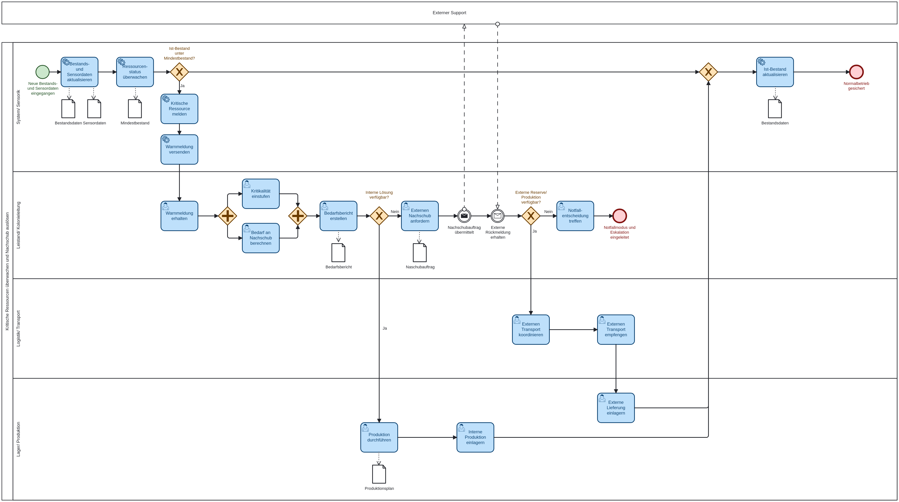

# AP11 – BPMN-Modellierung BP1 V2

## Kritische Ressourcen überwachen und Nachschub auslösen

Status: finale V2-Dokumentation zum BP1-BPMN-Modell

## Einordnung im Repository

Diese Datei dokumentiert die aktualisierte BPMN-Version V2 für den Businessprozess 1 „Kritische Ressourcen überwachen und Nachschub auslösen“.

Die ausführbare BPMN-Datei liegt zentral im Repository-Ordner:

[`../../bpmn/BP1V2Update_Kritische_Ressourcen_v11.bpmn`](../../bpmn/BP1V2Update_Kritische_Ressourcen_v11.bpmn)

Die zugehörige finale Exportgrafik liegt im Dokumentationsbereich:



Damit gehört die BPMN-V2-Dokumentation fachlich zu `documentation/APs/`, während die Bilddatei als unterstützendes Dokumentationsasset unter `documentation/docu-assets/` liegt. Die bearbeitbare BPMN-Quelldatei bleibt im zentralen Ordner `bpmn/`.

## Ziel der V2

BP1 ist der rote Faden der Abschlussdokumentation und verbindet:

```text
Use Case → Businessprozess → BPMN-Modell → Stored Procedures → Applikationsbezug
```

Die V2 macht den Ablauf klarer nachvollziehbar, weil Rollen, Datenübergaben und Entscheidungswege expliziter voneinander getrennt sind.

## Beteiligte

| Pool / Lane | Aufgabe |
|---|---|
| System / Sensorik | Bestands- und Sensordaten aktualisieren, Ressourcenstatus überwachen und Warnung versenden |
| Leitstand / Kolonieleitung | Kritikalität bewerten, Nachschubbedarf berechnen und Notfallentscheidung treffen |
| Lager / Produktion | interne Produktionsmöglichkeit prüfen, Produktion durchführen und einlagern |
| Logistik / Transport | externen Nachschub anfordern, Transport koordinieren und Lieferung einlagern |
| Externer Support | Rückmeldung zu externer Reserve oder Produktion geben |

## Ablauf der BPMN V2

1. Bestands- und Sensordaten werden aktualisiert.
2. Das System prüft den Ressourcenstatus gegen den Mindestbestand.
3. Bei unkritischem Bestand wird der Normalbetrieb fortgeführt.
4. Bei kritischem Bestand wird eine Warnung an Leitstand und Kolonieleitung gesendet.
5. Die Kolonieleitung bewertet die Kritikalität und berechnet den Nachschubbedarf.
6. Wenn eine interne Lösung möglich ist, wird Produktion eingeplant, durchgeführt und eingelagert.
7. Wenn keine interne Lösung möglich ist, wird externer Nachschub angefordert.
8. Der externe Support meldet, ob Reserve oder Produktion verfügbar ist.
9. Bei Verfügbarkeit werden Transport, Empfang und Einlagerung durchgeführt.
10. Bei fehlender Verfügbarkeit wird der Notfallmodus eingeleitet.

## Entscheidungslogik

| Entscheidung | Bedeutung |
|---|---|
| Ist-Bestand unter Mindestbestand? | trennt Normalbetrieb von Warn- und Nachschubpfad |
| Interne Lösung verfügbar? | entscheidet zwischen eigener Produktion und externer Nachschubanforderung |
| Externe Reserve / Produktion verfügbar? | entscheidet zwischen Transportprozess und Notfalleskalation |

## Daten- und Anwendungsbezug

| BPMN-Bezug | Technische Grundlage |
|---|---|
| Bestand gegen Mindestbestand prüfen | `getRessourcesBelowMin()` |
| kritische und gefährdete Ressourcen erkennen | `getRessourcesAtRisk()` |
| Nachschubbedarf fachlich ableiten | `getNachschubanforderungen()` |
| Lagerbezug anzeigen | `getRessourcenWithLager()` |

Die Anwendung zeigt den BP1-Bezug vor allem im Dashboard und auf der Ressourcenseite. Der vollständige operative Nachschubworkflow ist fachlich im BPMN V2 modelliert, aber nicht vollständig als eigener UI-Ablauf umgesetzt.

## Ergebnis

Die BPMN V2 beschreibt BP1 als vollständigen fachlichen Prozess von der Ressourcenüberwachung über interne oder externe Nachschubwege bis zur Eskalation im Notfall. Sie ist damit die passende Dokumentationsgrundlage für Abschlusspräsentation, Projektbericht und AP11.

## Dauer

Dauer: 1,5 Tage
